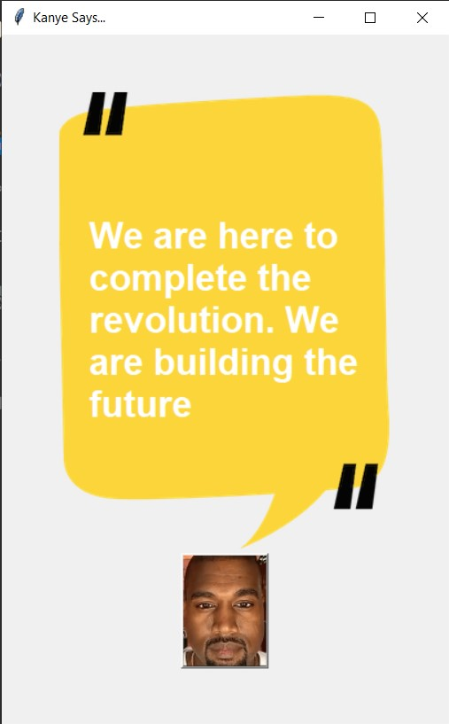

<div align="center">
  <h1 align="center"> Kanye</h1>
</div>

## About Weather-App:
This is a basic application to fetch random Kanye West's tweets using Kanye REST-API made in Python using Tkinter library.

## Screen Shots:
<div align="center">
  
</div>
<div align="center">
  
</div>
<div align="center">
  
</div>

### Steps to Run on Local Machine

***

#### Note: You need to have Python installed in your Local Machine if not, first install it from <a href="https://www.python.org/downloads/windows/">here</a>.
##### Step 1) Clone SameepHedaoo/Kanye-Rest-API.
##### Step 2) Open Kanye-Rest-API Cloned Directory in Command Prompt.
##### Step 3) Run the Following commands to install necessary Libraries:
```
pip install tk pillow
```
##### Step 4) Open main.py in Visual Studio code and Click Run.

***